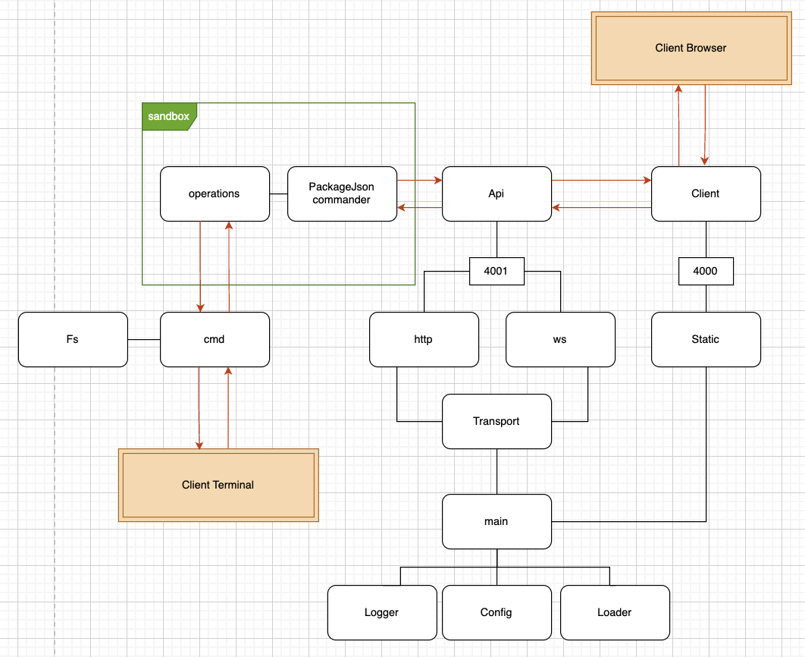

# pj-manager

This project is a package management tool for JavaScript/Node.js applications. It helps developers manage their dependencies, analyze package usage, and perform operations like updating or uninstalling packages.

In the project I will use [Conventional Commits](https://www.conventionalcommits.org/ru/v1.0.0/) and work with tags to use automated systems for filling the CHANGELOG file

- `feat`: new feature
- `fix`: bug fix
- `docs`: changes to the documentation
- `style`: changes that do not affect the meaning of the code (white-space, formatting, etc)
- `refactor`: code change that neither fixes a bug nor adds a feature
- `perf`: performance improvement
- `test`: adding missing tests
- `chore`: other changes that don't modify src or test files

During development I was inspired by the developments and professional experience of the guys [here](https://github.com/HowProgrammingWorks). Take a look, it's worth your attention

## Project description

The project is for developers who like order in their package.json file. They do not like extra and old dependencies that make the project worse. This is important when you have many projects to take care of, not only in your team.

Main features of the application:

Update library versions in different modes.
Go to the documentation of a library easily.
Find libraries that are not used but were not deleted.
See the history of changes in the package.json file.
Roll back changes if needed.
Choose between a terminal or a browser UI to work with the application.
I plan to add more features like:

- Learning about library details (co-dependencies, size, and tree shaking support).
- Seeing how the library affects the final build size.

If you have suggestions, write to me:

- My email: [avdienkosa@icloud.com](mailto:avdienkosa@icloud.com)
- My Telegram: [@avdienkosa](https://t.me/avdienkosa)

## Project structure

You can study the project specification [here](./docs/project-specification.md) in more detail. It will help you learn more about all the functional and non-functional requirements of the project. Also, study the project-specific data dictionary.

[My idea](#project-plan) is that from the starting point of the `main.js` file, a server is generated to serve the UI to the client. The client can use the UI to access the `command` in a special `sandbox` to run remote commands from the `cmd` directory.

