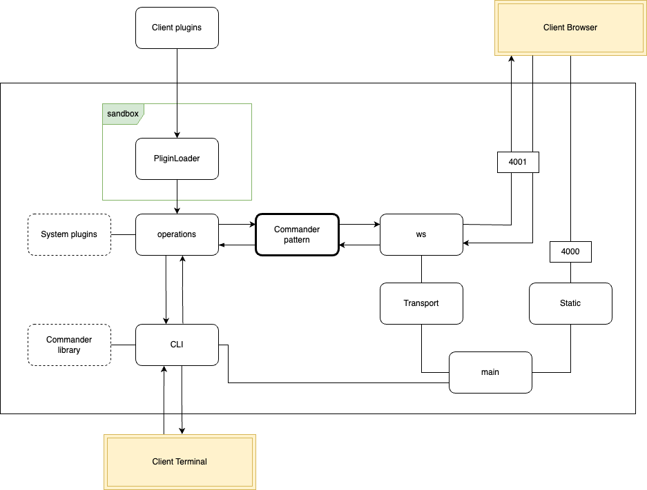

# pj-manager

## Installation

```bash
npm install --save-dev pjman
```

## Getting started

```bash
npx pjman init
```

The command will create a directory `.pjman` for you in the root of the project

```
/.pjman
    ├─── plugins
    │       └─── default.js
    ├─── backup
    ├─── history
    │       └─── commands.json
    └─── config.json
```

- `plugins/default.js` - Contains an example of a plugin. [Learn more about plugins](./docs/settings-plugins.md)
- `backup` - An empty folder that will be used to store the version of the target file. For example, you can call the command `pjman -n backup -t package.json` and the current version of the file will be saved. Providing an opportunity to roll back to it if necessary
- `history/commands.json` - The file contains the history of the commands that you have called. Provides the ability to work with the execution and rollback of commands. [Learn more about performing and rolling back operations](./docs/settings-rollback.md)
- `config.json` - Configures the operation of the application. [Learn more about config file](./docs/settings-config-file.md)

## List of commands to work from the terminal

- `npx pjman doc` - Open the project documentation
- `npx pjman ui` - Open the interface in a browser

The `plugin` has an alias `p`
The  `operation` has an alias `o`

- `npx pjman p -l` - The list of plugins available for operation. You know about your plugins yourself. The ones that I prepared are described [here](./docs/plugins-specification.md)
- `npx pjman p -n <plugin> -t <target>` - Calling the plugin with its name and purpose of use
- `npx pjman o -l` - The history of the commands with their IDs, timestamp, the name of the plagiarism and its purpose
- `npx pjman o -d <commandId>` - Deleting a record of a command call from the history by its ID
- `npx pjman o -c` - Clear the history of commands
- `npx pjman o -u` - Roll back the last command in the history. After the rollback, the command will be deleted from the history
- `npx pjman o -u <commandId>` - Roll back a specific command by its ID. After the rollback, the command will be deleted from the history

## About

This project is a package management tool for JavaScript/Node.js applications. It helps developers manage their dependencies, analyze package usage, and perform operations like updating or uninstalling packages.

In the project I will use [Conventional Commits](https://www.conventionalcommits.org/ru/v1.0.0/) and work with tags to use automated systems for filling the CHANGELOG file

- `feat`: new feature
- `fix`: bug fix
- `docs`: changes to the documentation
- `style`: changes that do not affect the meaning of the code (white-space, formatting, etc)
- `refactor`: code change that neither fixes a bug nor adds a feature
- `perf`: performance improvement
- `test`: adding missing tests
- `chore`: other changes that don't modify src or test files

During development I was inspired by the developments and professional experience of the guys [here](https://github.com/HowProgrammingWorks). Take a look, it's worth your attention

## Project description

The project is for developers who like order in their package.json file. They do not like extra and old dependencies that make the project worse. This is important when you have many projects to take care of, not only in your team.

Main features of the application:

Update library versions in different modes.
Go to the documentation of a library easily.
Find libraries that are not used but were not deleted.
See the history of changes in the package.json file.
Roll back changes if needed.
Choose between a terminal or a browser UI to work with the application.
I plan to add more features like:

- Learning about library details (co-dependencies, size, and tree shaking support).
- Seeing how the library affects the final build size.

If you have suggestions, write to me:

- My email: [avdienkosa@icloud.com](mailto:avdienkosa@icloud.com)
- My Telegram: [@avdienkosa](https://t.me/avdienkosa)

## Project structure

You can study the project specification [here](./docs/project-specification.md) in more detail. It will help you learn more about all the functional and non-functional requirements of the project. Also, study the project-specific data dictionary

[My idea](#project-plan) is that from the starting point of the file `main.js ` a server is being generated to serve the UI for the client. The client can use the UI to access the `command` which performs various useful operations on the file system and the standard package manager. The client can expand the set of operations by downloading plugins. They will go through the `sandbox' provided by the vm and will also be available for execution. If the client doesn't like the idea of working through the UI, they can work through the terminal.

<div id="project-plan" style="margin-top: 100px;"></div>


